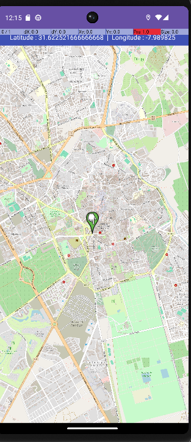

#  LAB 11 — GPS et Map (OpenStreetMap via OSMDroid)

> **Cours** : Programmation Mobile — Android avec Java  
> **Étudiante** : Sara Jamiri  

---

##  Objectifs

- Afficher une carte interactive dans l'application
- Demander la permission de localisation à l'utilisateur
- Écouter les changements de position (GPS/Réseau)
- Ajouter un marker qui se déplace à chaque nouvelle position
- Zoomer et centrer la carte sur la position détectée
- Afficher une boîte de dialogue si le GPS est désactivé

---

##  Pourquoi OSMDroid au lieu de Google Maps ?

Le lab original demande d'utiliser **Google Maps SDK**, ce qui nécessite une **clé API Google Maps** générée depuis Google Cloud Console.

Or, depuis 2018, Google Cloud exige **une carte bancaire** pour accéder à cette clé, même dans le cadre de l'essai gratuit. Dans un contexte académique, il n'est pas justifié de fournir des informations bancaires pour un TP.

**Solution adoptée : OSMDroid (OpenStreetMap)**
-  100% gratuit, aucune clé API requise
- Aucun compte requis
-  Mêmes fonctionnalités : carte, marker, GPS, zoom
-  Données cartographiques open source (OpenStreetMap)

---

##  Démonstration



> Carte centrée sur **Marrakech** avec marker positionné en temps réel.  
> Coordonnées affichées : Latitude `31.6225...` | Longitude `-7.989825`

---

##  Structure du projet

```
app/
└── src/main/
    ├── AndroidManifest.xml         ← Permissions GPS + Internet
    ├── java/com/sara/gpsmaplab11/
    │   └── MainActivity.java       ← Carte OSM + GPS + Marker
    └── res/layout/
        └── activity_main.xml       ← MapView + TextView coordonnées
```

---

##  Dépendances (`build.gradle.kts` Module :app)

```kotlin
implementation("org.osmdroid:osmdroid-android:6.1.18")
implementation("com.google.android.gms:play-services-location:21.3.0")
```

---

##  Permissions (`AndroidManifest.xml`)

```xml
<uses-permission android:name="android.permission.INTERNET"/>
<uses-permission android:name="android.permission.ACCESS_FINE_LOCATION"/>
<uses-permission android:name="android.permission.ACCESS_COARSE_LOCATION"/>
<uses-permission android:name="android.permission.WRITE_EXTERNAL_STORAGE"/>
```

---

##  Fonctionnement

```
1. Démarrage → carte OSM centrée sur Marrakech
        ↓
2. Demande permission GPS à l'utilisateur
        ↓
3. Permission accordée → écoute GPS_PROVIDER + NETWORK_PROVIDER
        ↓
4. Position détectée → marker déplacé + caméra centrée + coords affichées
        ↓
5. GPS désactivé → boîte de dialogue pour activer les paramètres
```

---

##  Scénarios testés

| Scénario | Résultat |
|---|---|
| Lancer l'app | Carte OSM affichée, centrée sur Marrakech |
| Permission GPS accordée | Écoute de position activée |
| Position simulée (émulateur) | Marker positionné + coordonnées affichées |
| GPS désactivé | Dialog "Voulez-vous activer le GPS ?" |

---

